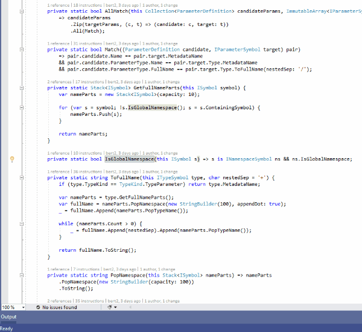
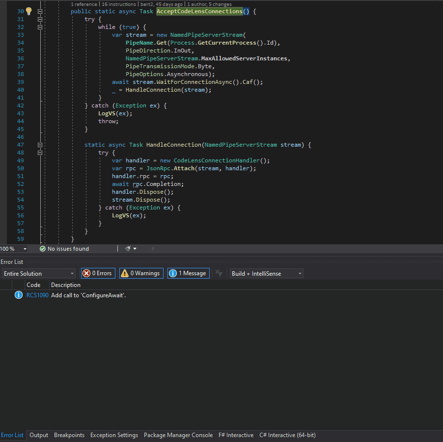
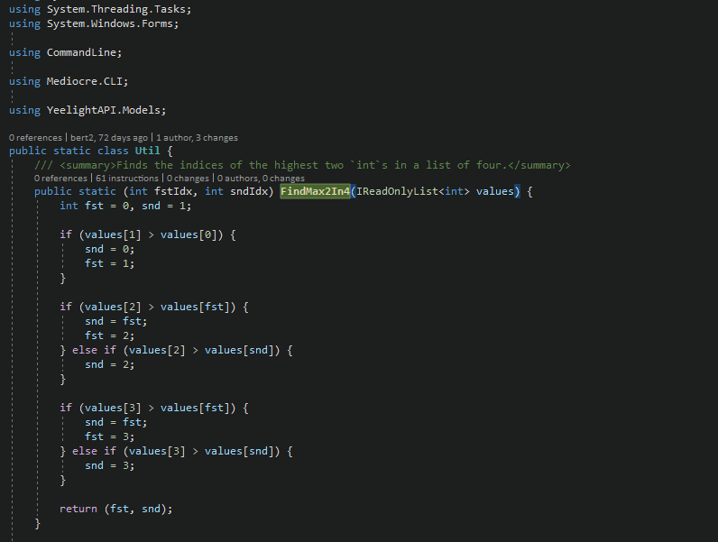
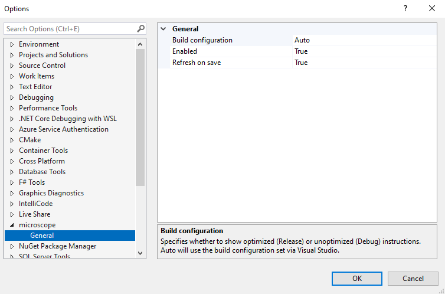

# microscope

[](https://ci.appveyor.com/project/bert2/microscope/branch/main) [](https://marketplace.visualstudio.com/items?itemName=bert.microscope) [](https://marketplace.visualstudio.com/items?itemName=bert.microscope) 

A CodeLens extension for Visual Studio that lets you inspect the intermediate language instructions of a method.



It also shows the compiler-generated code for lambdas/closures, local functions, `async` methods, and iterators:



It's mostly useful for learning and getting a better understanding of how C# works internally, but it can help when micro-optimizing a hot path too:



## Table of contents

- [Usage](#Usage)
- [Known issues](#known-issues)
- [Contributing](#contributing)
- [Roadmap](#roadmap)
- [Changelog](#changelog)
- [Versioning scheme](#versioning-scheme)
- [Credits](#credits)

## Usage

- Install latest stable release from the [Visual Studio Marketplace](https://marketplace.visualstudio.com/items?itemName=bert.microscope).
- Alternatively you can grab the [VSIX package](https://ci.appveyor.com/project/bert2/microscope/branch/main/artifacts) of the latest build from AppVeyor.
- The CodeLens appears on C# methods and displays the number of instructions that will be generated for the method.
- Click the CodeLens to get a detailed list of all instructions including their offsets and operands.
- Hover over an instruction in the list to see its documentation summary in a tooltip.
- Double-click an instruction in the list to navigate to its documentation on [docs.microsoft.com](https://docs.microsoft.com/dotnet/api/system.reflection.emit.opcodes).
- Hover over the CodeLens to see individual counts for the number of `box` and unconstrained `callvirt` instructions in the method.
- The CodeLens will automatically update everytime you save the current document. You can also click the "Refresh" button in the bottom left of the details view.
- Any types that the compiler generated for the method (e.g. for lambdas) will be shown below the list of instructions together with their methods and instructions.
- In case the retrieval of instructions fails the CodeLens will display `-` instead of a count. Hover over the CodeLens to see the exception that caused the failure.
- Configuration options are available in the Visual Studio settings ("Tools" > "Options..." > "microscope").



## Known issues

- The methods the compiler generates for local functions are not shown. This will be fixed in a future release.
- Visual Studio might freeze for a couple of seconds when you open the details view for a method with a huge amount of instructions (i.e. multiple thousands). This might be fixed in a future release.

## Contributing

Bug reports and pull requests are always welcome!

### Issue tracker

Feel free to [create an issue on GitHub](https://github.com/bert2/microscope/issues/new) if you found a bug, have a question or got an idea how to improve microscope.

### Cloning the source

```powershell
PS> git clone https://github.com/bert2/microscope.git
PS> cd microscope
```

### Building

Building microscope from source requires Visual Studio 2019 and the [Visual Studio SDK](https://docs.microsoft.com/en-us/visualstudio/extensibility/installing-the-visual-studio-sdk?view=vs-2019).

You can build using either Visual Studio or the build script located in microscope's root directory:

```powershell
PS> ./build.ps1 compile
```

### Running the tests

The tests are implemented using MSTest. You can execute them via Visual Studio or from microscope's root directory:

```powershell
PS> ./build.ps1 test # will also build
```

### `nuke` global tool

Microscope uses [nuke](https://github.com/nuke-build/nuke) as its build tool. You can install nuke's global tool via `dotnet`:

```powershell
PS> dotnet tool install Nuke.GlobalTool --global
```

Don't forget to setup its [auto-completion](https://www.nuke.build/docs/running-builds/global-tool.html#shell-snippets) too.

Even though the global tool is not required, it makes life a little bit easier:

```powershell
PS> nuke test # build and run tests
```

## Roadmap

Since the 1.0.0 release has all the features I wanted this extension to have, I will devote my time to other projects now. New features will still be released in the future, but they will come less frequently.

### Future releases

- show compiler-generated code for local functions
- support more code elements? (properties, classes, ...)
- show C# code in details view
- VB support
- F# support?
- lazy load when method has too many instructions to prevent temporarily freezing VS
- don't show CodeLens on interface/abstract methods
- edge cases:
    - what happens when opening a project instead of a solution?
    - what happens when opening a file without opening the project?
- reduce namespace noise in operands column of details view
  - setting for that
  - checkbox in details view for the setting as well
- is it possible to move in-memory compiling and IL retrieval out of the VS process?
    - can we even access the `Compilation` out-of-proc?

## Changelog

### 1.0.3

- Fixes `Mono.Cecil.AssemblyResolutionException`s during retrieval of compiler-generated code.

### 1.0.2

- Fixes `NullReferenceException`s during retrieval of compiler-generated code.

### 1.0.1

- Fixes a bug where the compiler-generated code for nested lambdas would not be shown.
- Fixes a bug where compiler-generated code for unrelated lambdas would be shown.
- Fixes a bug where the compiler-generated class for anonymous types would not be shown.

### 1.0.0

- Instructions of compiler-generated types/methods are now also shown below the instructions of the code-lensed method.

### 0.5.3

- Refactoring to greatly reduce the amount of data exchanged between the out-of-process CodeLens engine and Visual Studio.

### 0.5.2

- Fixes a bug where clicking on an instruction's opcode that has a trailing dot in its name would not open the correct documentation page.

### 0.5.1

- Fixes a bug where the documentation of instructions with opcodes that have a trailing dot in their name could not be retrieved.
- Adds a new custom UI for the details view, replacing the default grid UI. This is only a minor visual change, but enables future features like including instructions from compiler-generated classes or showing the CodeLens on classes.

### 0.5.0

- Add settings page to de/activate auto-refresh on save.

### 0.4.0

- Instructions are now refreshed automatically when saving a file.
- Don't duplicate compiler errors in the tooltip for failed CodeLenses.

### 0.3.0

- Show XML documentation of OpCode as tooltip when hovering an instruction.

### 0.2.0

- Double-clicking an instruction in the details view now opens its documentation in the browser.

### 0.1.3

- Fixes an issue where the "Refresh" button might not work when multiple instances of VS where open.

### 0.1.2

- Only fixes development problems with the pipe connections between VS and the CodeLenses by using a different pipe for the VS experimental instance.

### 0.1.1

- Fixes a bug where the "Refresh" button was not working properly when too many CodeLenses where loaded at once.
- Fixes a regression bug where instruction retrieval failures would not be shown in the CodeLens tooltip.

### 0.1.0

- Adds a "Refresh" button to the details view which retrieves the instructions of the method again.

### 0.0.5

- Fixes an issue where IL retrieval failed for projects with multiple target frameworks.

### 0.0.4

- Overload resolution has been extended to handle `dynamic` parameters as well. There no longer should be any issues saying that a method couldn't be found or that a method couldn't be uniquely identified.

### 0.0.3

- Overload resolution has been extended to handle more types: arrays, pointers, and `ref`s.

### 0.0.2

- Overload resolution has been reworked completely and now works better with generic and/or nested types. Some issues might still remain and will be addressed in the next release.

### 0.0.1

Intitial preview release.

- Enables CodeLens on C# methods showing the number of IL instructions.
- Clicking the CodeLens opens a details view listing all IL instructions of the method.
- Refreshing the CodeLens after code changes currently requires closing and re-opening the C# source file.

## Versioning scheme

Microscope's versioning scheme uses a manually maintained [semantic version](https://semver.org/) with an appended build number. A semver bump is triggered by creating a Git tag. The build version is auto-incremented by [AppVeyor](https://ci.appveyor.com/project/bert2/microscope/branch/main).

## Credits

### Similar tools

- [VSCodeILViewer](https://github.com/JosephWoodward/VSCodeILViewer) by Joseph Woodward only works with VSCode and isn't updated anymore. Joseph wrote a nice [article](https://josephwoodward.co.uk/2017/01/c-sharp-il-viewer-vs-code-using-roslyn) on its implementation which helped me getting started.
- [Msiler](https://marketplace.visualstudio.com/items?itemName=segrived.msiler2017) by Evgeniy Babaev looks like an excellent tool, but unfortunately it's not available for Visual Studio 2019. I discovered it when I was way into the development of microscope and if I had found it earlier, I might have tried patching Msiler first.

### Dependencies

- [Roslyn](https://github.com/dotnet/roslyn) compiles the current project in memory.
- [Mono.Cecil](https://github.com/jbevain/cecil) retrieves the IL instructions from the compiled project.
- [nuke](https://github.com/nuke-build/nuke) orchestrates the builds for microscope.
