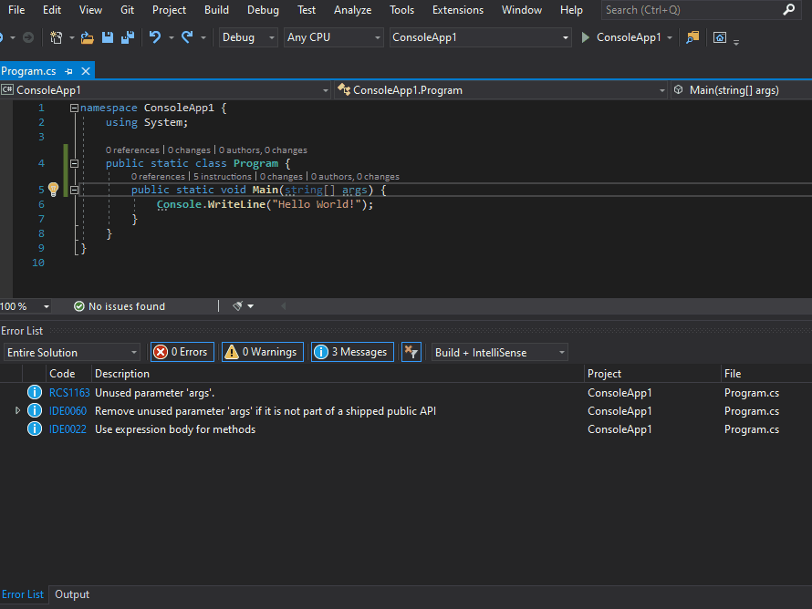

# microscope

[](https://ci.appveyor.com/project/bert2/microscope/branch/main) [](https://marketplace.visualstudio.com/items?itemName=bert.microscope) [](https://marketplace.visualstudio.com/items?itemName=bert.microscope) 

A CodeLens extension for Visual Studio that lets you inspect the intermediate language instructions of a method.



## Usage

- Install latest stable release from the [Visual Studio Marketplace](https://marketplace.visualstudio.com/items?itemName=bert.microscope).
- Alternatively you can grab the [VSIX package](https://ci.appveyor.com/project/bert2/microscope/branch/main/artifacts) of the latest build from AppVeyor.
- The CodeLens appears on C# methods and displays the number of instructions that will be generated for the method.
- Hover over the CodeLens to see individual counts for the number of `box` and unconstrained `callvirt` instructions in the method.
- Click the CodeLens to get a detailed list of all instructions including their offsets and operands.
- The CodeLens currently won't be updated after the method has been changed. In order to refresh it you will have to click the "Refresh" button in bottom left of the details view. Auto-update will be implemented for the 1.0 release.
- In case the retrieval of instructions fails the CodeLens will display `-` instead of a count. Hover over the CodeLens to see the exception that caused the failure.

## Known issues

- Instructions are not updated automatically on code changes. Use the "Refresh" button in the details view to update the instructions manually.
- The "Refresh" button is not available in case a CodeLens could not be created for the method (e.g. when there are compiler errors in the project). In that case you have to fix the compiler errors and then either close and re-open the source file or dock the CodeLens popup with the button in the top right of the details view.

## Contributing

Bug reports and pull requests are always welcome!

### Issue tracker

Feel free to [create an issue on GitHub](https://github.com/bert2/microscope/issues/new) if you found a bug, have a question or got an idea how to improve microscope.

### Cloning the source

```powershell
PS> git clone https://github.com/bert2/microscope.git
PS> cd microscope
```

### Building

Building microscope from source requires Visual Studio 2019 and the [Visual Studio SDK](https://docs.microsoft.com/en-us/visualstudio/extensibility/installing-the-visual-studio-sdk?view=vs-2019).

You can build using either Visual Studio or the build script located in microscope's root directory:

```powershell
PS> ./build.ps1 compile
```

### Running the tests

The tests are implemented using MSTest. You can execute them via Visual Studio or from microscope's root directory:

```powershell
PS> ./build.ps1 test # will also build
```

### `nuke` global tool

Microscope uses [nuke](https://github.com/nuke-build/nuke) as its build tool. You can install nuke's global tool via `dotnet`:

```powershell
PS> dotnet tool install Nuke.GlobalTool --global
```

Don't forget to setup its [auto-completion](https://www.nuke.build/docs/running-builds/global-tool.html#shell-snippets) too.

Even though the global tool is not required, it makes life a little bit easier:

```powershell
PS> nuke test # build and run tests
```

## TODO

### Next release

- I'm not sure yet. Either the auto-update of the CodeLens when the method code changes or retrieval of opcode documentation to show it in the tooltip.

### Release (1.0.0)

- update IL when typing, saving, building, or switching the build configuration
- XML documentation summary of op code as tooltip
- double-clicking an instruction navigates to MSDN page of op code

### Future releases

- don't show CodeLens on interface/abstract methods
- cache `AssemblyDefintion`s?
    - results of basic performance measurement:
        - first CodeLens takes ~1 sec, because in-memory compiling takes long
        - everything seems to be cached afterwards and instructions can be retrieved in 15 - 40 ms
        - compiling still takes most of the time (10 - 30 ms)
    - would shave off most of the runtime cost
    - cash needs to be invalidated on code changes
    - is it worth the memory cost in big solutions?
    - reading an `AssemblyDefintion` is not thread-safe
- edge cases:
    - what happens when opening a project instead of a solution?
    - what happens when opening a file without opening the project?
- settings page to configure update frequency
- reduce namespace noise in operands column of details view
  - setting for that
  - checkbox in details view for the setting as well
- show C# code in details view
  - extra column or above first instruction? (latter needs custom UI)
- VB support
- F# support?
- is it possible to move in-memory compiling and IL retrieval out of the VS process?
    - can we even access the `Compilation` out-of-proc?
- custom UI?
- support C# features that use compiler-generated classes (would benefit from custom UI)
  - async state machines
  - enumerator state machines
  - lambdas
  - local functions
- support more code elements? (properties, classes, ...)

## Changelog

### 0.1.3

- Fixes an issue where the "Refresh" button might not work when multiple instances of VS where open.

### 0.1.2

- Only fixes development problems with the pipe connections between VS and the CodeLenses by using a different pipe for the VS experimental instance.

### 0.1.1

- Fixes a bug where the "Refresh" button was not working properly when too many CodeLenses where loaded at once.
- Fixes a regression bug where instruction retrieval failures would not be shown in the CodeLens tooltip.

### 0.1.0

- Adds a "Refresh" button to the details view which retrieves the instructions of the method again.

### 0.0.5

- Fixes an issue where IL retrieval failed for projects with multiple target frameworks.

### 0.0.4

- Overload resolution has been extended to handle `dynamic` parameters as well. There no longer should be any issues saying that a method couldn't be found or that a method couldn't be uniquely identified.

### 0.0.3

- Overload resolution has been extended to handle more types:
  - arrays
  - pointers
  - `ref`s

### 0.0.2

- Overload resolution has been reworked completely and now works better with generic and/or nested types. Some issues might still remain and will be addressed in the next release.

### 0.0.1

Intitial preview release.

- Enables CodeLens on C# methods showing the number of IL instructions.
- Clicking the CodeLens opens a details view listing all IL instructions of the method.
- Refreshing the CodeLens after code changes currently requires closing and re-opening the C# source file.

## Versioning scheme

Microscope's versioning scheme uses a manually maintained [semantic version](https://semver.org/) with an appended build number. A semver bump is triggered by creating a Git tag. The build version is auto-incremented by [AppVeyor](https://ci.appveyor.com/project/bert2/microscope/branch/main).

## Credits

### Similar tools

- [VSCodeILViewer](https://github.com/JosephWoodward/VSCodeILViewer) by Joseph Woodward only works with VSCode and isn't updated anymore. Joseph wrote a nice [article](https://josephwoodward.co.uk/2017/01/c-sharp-il-viewer-vs-code-using-roslyn) on its implementation which helped me getting started.
- [Msiler](https://marketplace.visualstudio.com/items?itemName=segrived.msiler2017) by Evgeniy Babaev looks like an excellent tool, but unfortunately it's not available for Visual Studio 2019. I discovered it when I was way into the development of microscope and if I had found it earlier, I might have tried patching Msiler first.

### Dependencies

- [Roslyn](https://github.com/dotnet/roslyn) compiles the current project in memory.
- [Mono.Ceceil](https://github.com/jbevain/cecil) retrieves the IL instructions from the compiled project.
- [nuke](https://github.com/nuke-build/nuke) orchestrates the builds for microscope.
